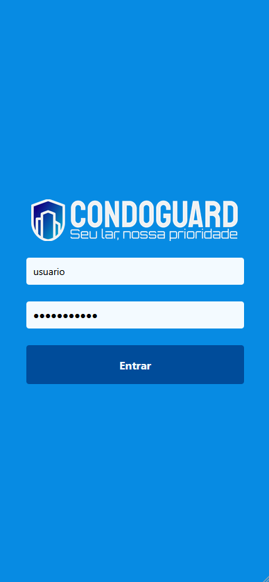
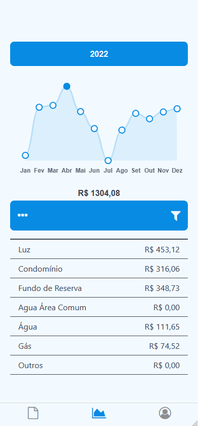
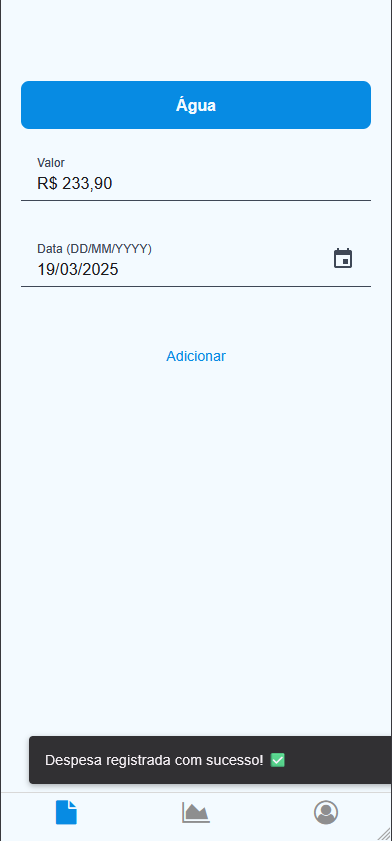
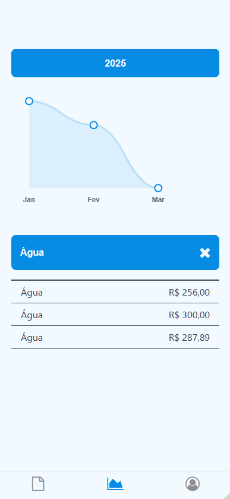

    

## App

🌟 **CONDOGUARD App** é um aplicativo mobile para ajudar residências e condomínios a administrar suas despesas e prever possíveis problemas futuros. Este é o repositório do mobile da aplicação, desenvolvido com **React Native** + **Expo** e **TypeScript**.

